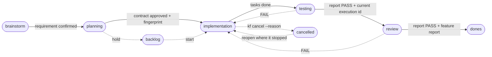
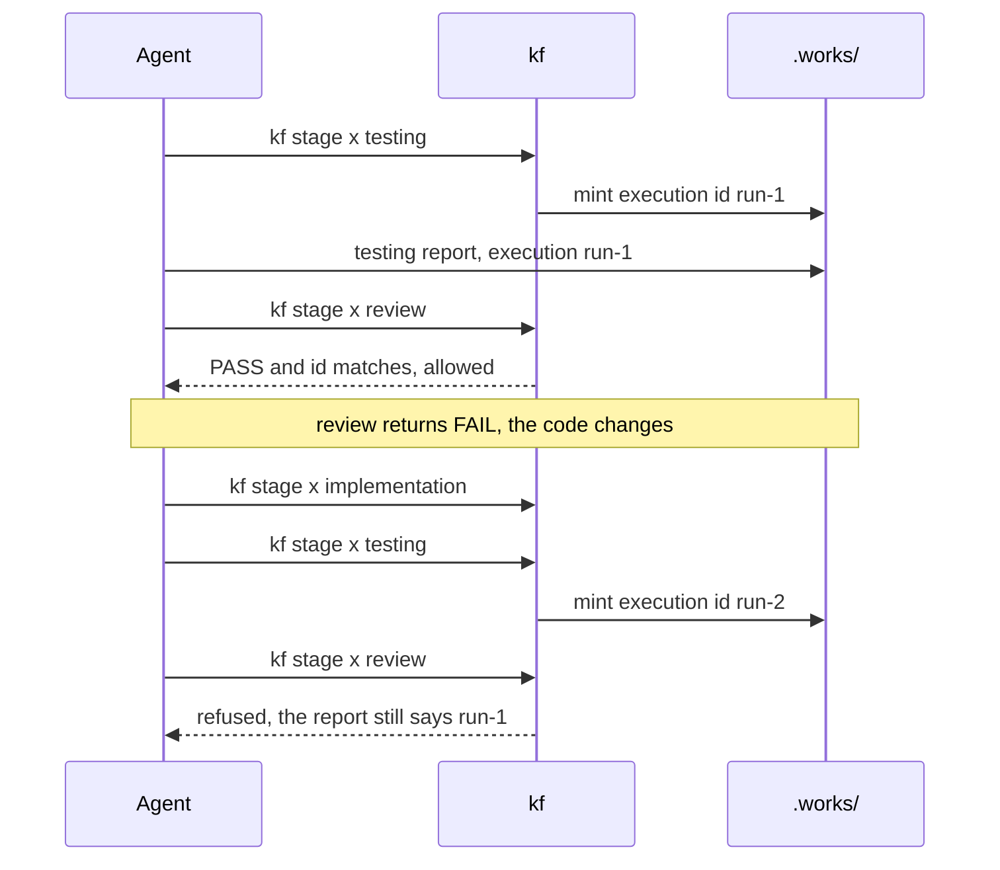
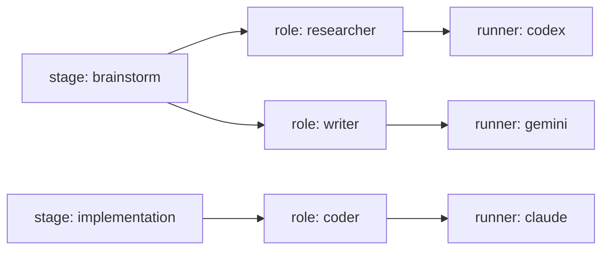

# kanban-flow

An AI coding agent will tell you the tests passed, the plan was followed, the
edge cases are covered. Sometimes it is right, and you cannot tell which time
from the transcript, because the transcript is written by the same thing you are
checking. kanban-flow moves the proof into files on disk: the gates do not read
the agent's summary, they read `.works/`.

## How it works

Every work item walks one pipeline, and only the CLI moves it between stages:

```text
brainstorm → planning → implementation → testing → review → dones
                 ↘ backlog ↗                 ↺ FAIL loops back
any stage → cancelled, with a reason on the record
```



Solid arrows are the happy path, and every label on one is a gate the CLI checks
before the folder moves. Dotted arrows are the ways out: hold it in backlog,
loop back on a FAIL, or stop it for good with a reason on the record.

Most stages owe an artifact. A transition is refused when that artifact is
missing, empty, still full of template placeholders, or carrying a real secret.
A testing report that does not say `PASS` does not reach review; a review report
that does not say `PASS` does not archive. `--force` overrides a gate and is
recorded in `.kfw.json` where a reviewer will find it.

Three decisions belong to a human: marking the requirement `status: confirmed`,
approving the execution contract, and choosing whether to start now or hold it
in backlog. The approval is bound to a SHA-256 fingerprint of the contract, so
editing the plan invalidates it, and no stage further forward accepts the item
until it returns to planning and is approved again.

## Install

Needs Node 20 or newer.

```bash
npm install -g @phuthuycoding/kanban-flow
```

That puts `kf` on your PATH. To work from source instead:

```bash
git clone https://github.com/phuthuycoding/kanban-flow.git
cd kanban-flow && npm install && npm run build && npm link
```

## A run, end to end

The agent runs the commands and writes the artifacts between them, taking every
template and path from `kf instruct`. `kf status` shows the artifact checklist;
`kf validate` reports what is actually blocking a gate, traceability included.

```bash
cd your-project
kf init                             # asks a few questions, seeds .kf/, installs the skills
kf new user-login --context auth    # opens Phase 1 in brainstorm
kf instruct spec-requirement --change user-login
# write the requirement, set its frontmatter to status: confirmed — decision one
kf stage user-login planning
# write the plan, the use-case index, one file per UC, the diagram, the test plan
kf approve user-login               # decision two; fingerprints all of it
kf stage user-login implementation  # or backlog — decision three
kf stage user-login testing         # mints a fresh execution id
# write the testing report, carrying that id and real exit codes
kf stage user-login review          # refused unless that report says PASS
# write the review report, then the feature report
kf archive user-login               # refused unless the review says PASS
```

## What is actually different

Most of the mechanics here exist elsewhere: requirement-to-test traceability as
a CI gate, role-to-runner configuration, hash-bound plan approval, a cancelled
state with a mandatory reason, blocking placeholders. No claim to inventing them.

One mechanic I have not found anywhere else: **every entry into testing mints a
fresh execution id**, and a report is accepted only when its `execution:` field
matches the current one. Fix a failure, go round again, and yesterday's green
report is inert. Stale test evidence stops being a way to pass.



The old report is not deleted, argued with, or trusted less. It simply stops
matching, so passing again costs exactly one honest test run. The rest of the
case is the combination: a gate reading files instead of claims, an approval
bound to the bytes it approved, evidence that expires.

## Multi-agent harness

Stages route to **roles**, roles point at **runners**. A runner is one way to
invoke a CLI: its argv, its permission flags, how its session resumes. A role is
a job such as researcher or tester. Pointing a role at an existing runner is one
line; a runner nobody has declared yet is a few more.

```json
"harness": {
  "main": "architect",
  "roles": { "architect": "claude", "researcher": "codex", "writer": "gemini", "coder": "claude" },
  "stages": { "brainstorm": ["researcher", "writer"], "implementation": "coder" },
  "runners": {
    "claude": { "start": ["claude", "-p", "{prompt}"] },
    "codex":  { "start": ["codex", "exec", "{prompt}"] },
    "gemini": { "start": ["gemini", "-p", "{prompt}"] }
  }
}
```



A stage runs its roles in order, and a role that declares an `output` file hands
it to the next one. A role reporting neither `DONE` nor `DONE_WITH_CONCERNS`
stops the chain. Sessions are kept per work item and per role, so two roles on
one CLI never share context.

```bash
kf harness                     # stage → role chain, role → runner, which CLIs are on PATH
kf run user-login --detach     # run the current stage's chain; poll with kf runs
kf runs user-login --json      # each run: role, runner, status, usage where reported
```

Presets ship for claude, codex, devin, gemini and opencode. Assign no stages and the harness stays out of the way.

## Documentation

The full reference lives in [docs/workflow](docs/workflow/README.md): the [state
machine](docs/workflow/state-machine.md), every [gate](docs/workflow/gates.md), the
[artifacts](docs/workflow/artifacts.md), the [CLI reference](docs/workflow/cli-reference.md),
the [harness](docs/workflow/harness.md), the [dashboard](docs/workflow/dashboard.md). Release
notes: [CHANGELOG.md](CHANGELOG.md).

## License — MIT
