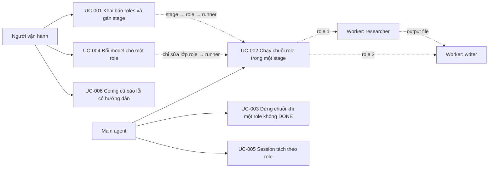

# Use Case Diagram

- Actors: Người vận hành (cấu hình, quan sát), Main agent (điều phối, giữ human gate), Worker agent (CLI headless đóng một role)
- Use cases: UC-001…UC-006 như index; UC-002 là luồng chính, UC-003/UC-005 là biến thể của cùng lệnh `kf run`
- Relationships: Lớp `role` nằm giữa stage và runner nên UC-004 không chạm UC-001; kết quả của role trước tới role sau qua file `output` trên đĩa, không qua bộ nhớ hội thoại
