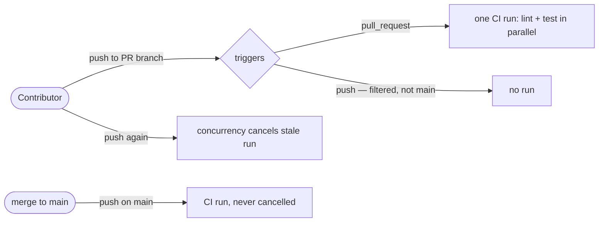

# Use Case Diagram

```mermaid
flowchart LR
    C([Contributor]) -->|push to PR branch| T{triggers}
    T -->|pull_request| R[one CI run: lint + test in parallel]
    T -->|push — filtered, not main| X[no run]
    C -->|push again| CG[concurrency cancels stale run]
    M([merge to main]) -->|push on main| R2[CI run, never cancelled]
```
