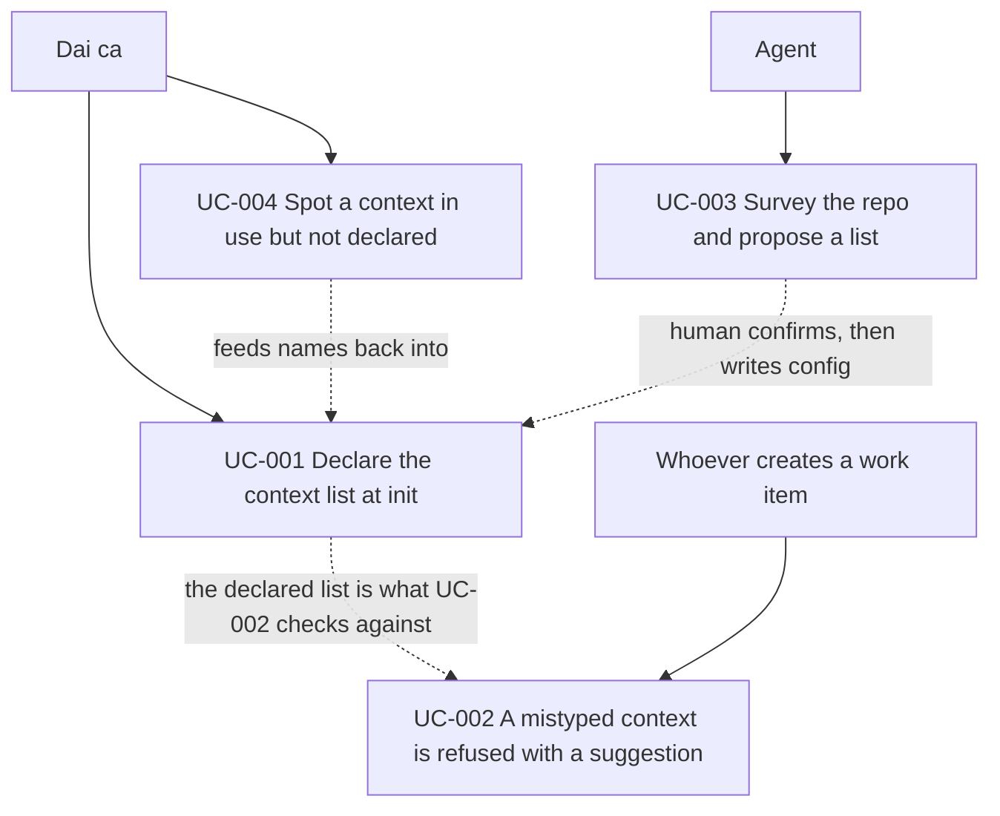

# Use Case Diagram

## Notes
- Actors: đại ca là người chốt danh sách, agent chỉ đề xuất, và bất kỳ ai gõ `kf new` là người chạm vào rào chắn.
- Relationships: UC-003 nuôi UC-001, UC-001 là điều kiện để UC-002 có gì mà đối chiếu, UC-004 chỉ ra chỗ danh sách còn thiếu để quay lại UC-001.
- Agent không có mũi tên nào trỏ thẳng vào việc ghi config: đó là chủ ý, không phải thiếu sót.
