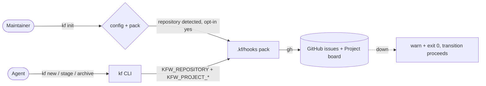

# Use Case Diagram

```mermaid
flowchart LR
    M([Maintainer]) -->|kf init| I{config + pack}
    I -->|repository detected, opt-in yes| H[.kf/hooks pack]
    A([Agent]) -->|kf new / stage / archive| K[kf CLI]
    K -->|KFW_REPOSITORY + KFW_PROJECT_*| H
    H -->|gh| GH[(GitHub issues + Project board)]
    GH -.->|down| W[warn + exit 0, transition proceeds]
```
