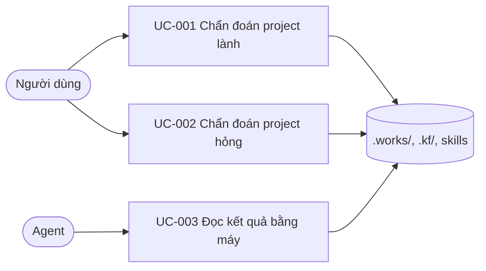

# Use Case Diagram

## Feature
kf-doctor

```mermaid
flowchart LR
    U([Người dùng]) --> UC1[UC-001 Chẩn đoán project lành]
    U --> UC2[UC-002 Chẩn đoán project hỏng]
    A([Agent]) --> UC3[UC-003 Đọc kết quả bằng máy]
    UC1 --> FS[(.works/, .kf/, skills)]
    UC2 --> FS
    UC3 --> FS
```

Doctor chỉ đọc từ filesystem; không mũi tên nào đi theo chiều ghi.
