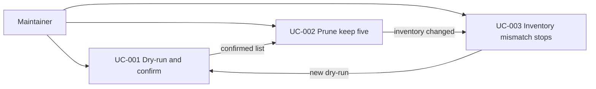

# Use Case Diagram

```mermaid
flowchart LR
  M[Maintainer] --> UC1[UC-001 Dry-run and confirm]
  M --> UC2[UC-002 Prune keep five]
  M --> UC3[UC-003 Inventory mismatch stops]
  UC1 -->|confirmed list| UC2
  UC3 -->|new dry-run| UC1
  UC2 -->|inventory changed| UC3
```

- Actors: Maintainer
- Use cases: UC-001, UC-002, UC-003
- Relationships: confirm (UC-001) gates prune (UC-002); mismatch (UC-003) returns to dry-run.
