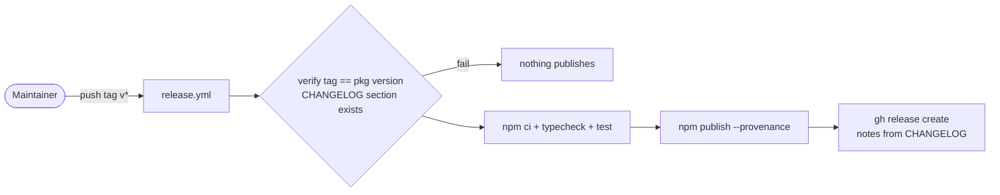

# Use Case Diagram

```mermaid
flowchart LR
    M([Maintainer]) -->|push tag v*| T[release.yml]
    T --> V{verify tag == pkg version<br/>CHANGELOG section exists}
    V -->|fail| X[nothing publishes]
    V --> C[npm ci + typecheck + test]
    C --> P[npm publish --provenance]
    P --> R[gh release create<br/>notes from CHANGELOG]
```
