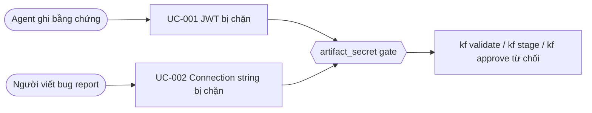

# Use Case Diagram

## Feature
secret-scan-formats

```mermaid
flowchart LR
    A([Agent ghi bằng chứng]) --> UC1[UC-001 JWT bị chặn]
    H([Người viết bug report]) --> UC2[UC-002 Connection string bị chặn]
    UC1 --> G{{artifact_secret gate}}
    UC2 --> G
    G --> S[kf validate / kf stage / kf approve từ chối]
```
