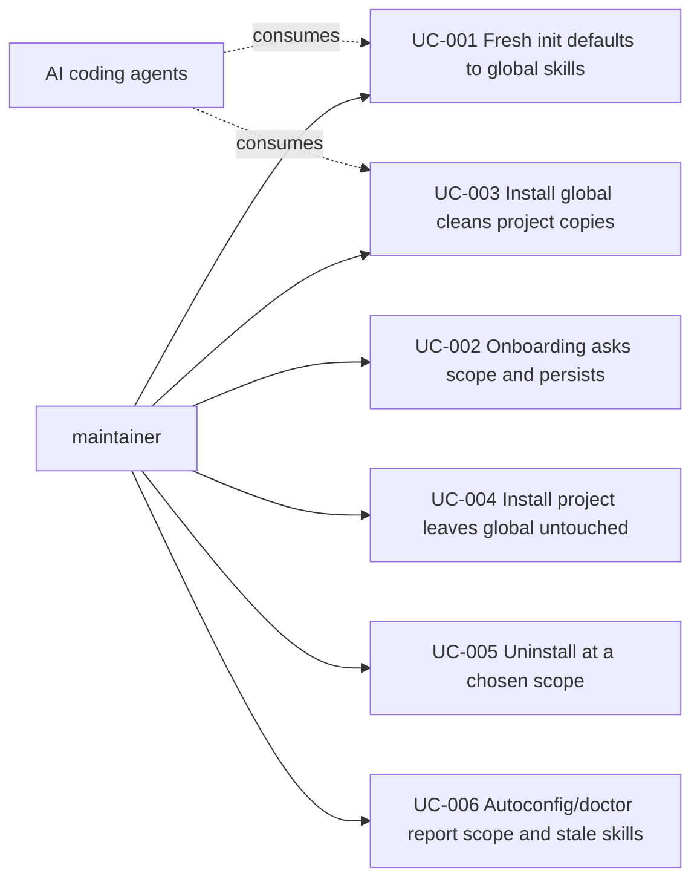

# Use Case Diagram

- Actors: maintainer (drives all kf commands), AI coding agents (passive consumers of installed skills)
- Use cases: UC-001..UC-006 as indexed in `phase-2-use-case-specification.md`
- Relationships: the maintainer triggers every use case through `kf` commands; agents only read the resulting `~`/project skill dirs — no UC where an agent acts.
