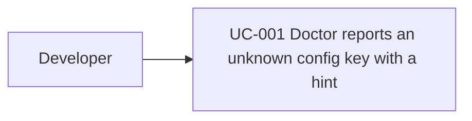

# Use Case Diagram

```mermaid
flowchart LR
  A[Developer] --> UC1[UC-001 Doctor reports an unknown config key with a hint]
```

- Actors: Developer running `kf doctor`
- Use cases: UC-001
- Relationships: the developer runs `kf doctor` (or `--json`, `--fix`) and reads the warning
