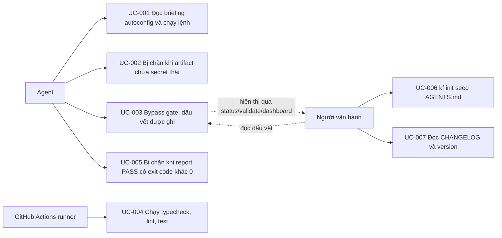

# Use Case Diagram

- Actors: Agent (chạy `kf` trong pipeline), GitHub Actions runner, Người vận hành (đại ca)
- Use cases: UC-001 … UC-007 như index; UC-002 và UC-005 là hai hành vi chặn của validator, UC-003 là hành vi ghi vết
- Relationships: Người vận hành là bên tiêu thụ dấu vết của UC-003; UC-004 bao trùm toàn bộ test của các UC còn lại khi chạy trên CI
