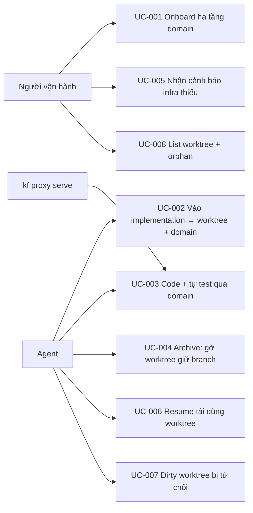

# Use Case Diagram

- Actors: Người vận hành, Agent, `kf proxy serve` (daemon)
- Use cases: UC-001..UC-008 như index
- Relationships: UC-003 phụ thuộc UC-001 (infra) và UC-002/UC-006 (worktree); UC-004/UC-007 là hai nhánh teardown của cùng sự kiện archive/cancel; `kf proxy serve` là supporting actor phục vụ request tới domain.
