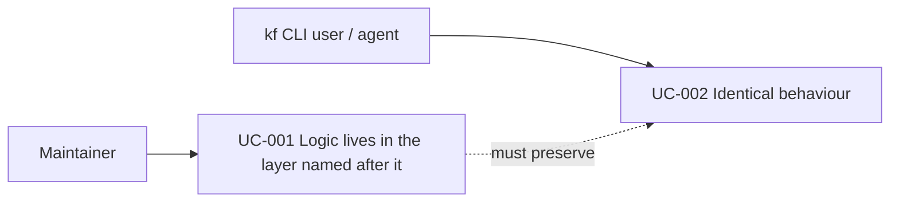

# Use Case Diagram

```mermaid
flowchart LR
  M[Maintainer] --> UC1[UC-001 Logic lives in the layer named after it]
  U[kf CLI user / agent] --> UC2[UC-002 Identical behaviour]
  UC1 -. must preserve .-> UC2
```

- Actors: Maintainer, kf CLI user / agent
- Use cases: UC-001, UC-002
- Relationships: the restructuring of UC-001 must preserve UC-002.
