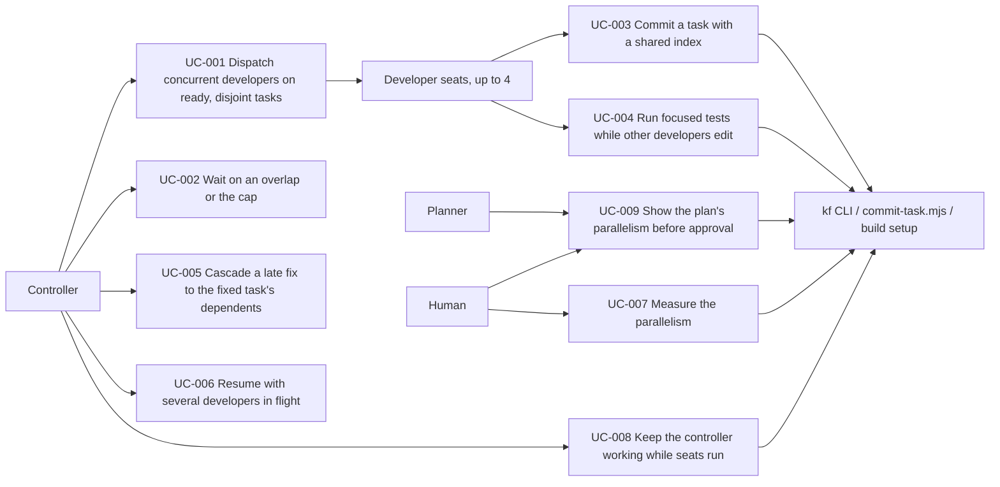

# Use Case Diagram

```mermaid
flowchart LR
  C[Controller]
  D[Developer seats, up to 4]
  P[Planner]
  H[Human]
  K[kf CLI / commit-task.mjs / build setup]
  P --> UC9[UC-009 Show the plan's parallelism before approval]
  H --> UC9
  C --> UC1[UC-001 Dispatch concurrent developers on ready, disjoint tasks]
  C --> UC2[UC-002 Wait on an overlap or the cap]
  C --> UC5[UC-005 Cascade a late fix to the fixed task's dependents]
  C --> UC6[UC-006 Resume with several developers in flight]
  C --> UC8[UC-008 Keep the controller working while seats run]
  D --> UC3[UC-003 Commit a task with a shared index]
  D --> UC4[UC-004 Run focused tests while other developers edit]
  H --> UC7[UC-007 Measure the parallelism]
  UC1 --> D
  UC3 --> K
  UC4 --> K
  UC7 --> K
  UC8 --> K
  UC9 --> K
```
