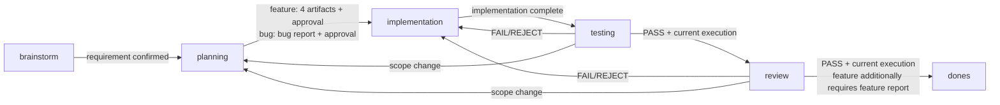

# Gate và artifact contract

Gate được kiểm tra khi rời state hiện tại. `kf validate` dùng cùng validator để báo trước lỗi; `kf stage` và `kf archive` sẽ chặn transition nếu gate không đạt.

## Artifact bắt buộc

| Phase | File | Nội dung tối thiểu | Mở khóa |
| --- | --- | --- | --- |
| 1 — Brainstorm / bug triage | `phase-1-spec-requirement.md` (bug dùng template bug-report) | feature: requirement + FR-XXX; bug: reproduction, actual/expected, severity, regression strategy | Planning |
| 2 — Planning (feature) | `phase-2-implementation-plan.md` | scope, task, impact, DoD, rủi ro | Execution contract |
| 2 — Planning (feature) | `phase-2-use-case-specification.md` + `use-cases/UC-###.md` | index/coverage ở phase file; mỗi UC có precondition, flow, alternate/error flow riêng | Thiết kế và test |
| 2 — Planning (feature) | `phase-2-use-case-diagram.md` | actor/use-case diagram hợp lệ | Traceability |
| 2 — Planning (feature) | `phase-2-test-case.md` | TC-XXX liên kết FR-XXX/UC-XXX | Testing contract |
| 4 — Testing | `phase-4-testing-result.md` | execution ID hiện tại, PASS/FAIL/REJECT/BLOCKED, evidence | Review hoặc repair loop |
| 5 — Review | `phase-5-review-report.md` | execution ID hiện tại, PASS/FAIL/REJECT/REQUIREMENT_BUG, findings | Archive hoặc repair loop |
| 6 — Artifact (feature) | `phase-6-feature-report.md` | tổng kết, thay đổi, test, docs, known limitation | Feature hoàn tất |

Implementation không có artifact bắt buộc riêng trong schema, nhưng skill implement phải hoàn tất task trong plan và để code ở trạng thái có thể test.

## Canonical output khi vào `dones`

`kf archive` copy từ feature folder sang các đường dẫn ổn định theo context. Chỉ feature mới tự động copy canonical docs:

| Nguồn | Đích |
| --- | --- |
| `phase-1-spec-requirement.md` | `docs/requirement/{context}/{feature}.md` |
| `phase-2-use-case-specification.md` | `docs/use-cases/{context}/{feature}/README.md` (index) |
| `use-cases/UC-###.md` | `docs/use-cases/{context}/{feature}/UC-###.md` (mỗi use case một file) |
| `phase-2-use-case-diagram.md` | `docs/use-cases/{context}/{feature}/diagram.md` |
| `phase-2-test-case.md` | `docs/testplan/{context}/{feature}.md` |
| `phase-4-testing-result.md` | `docs/testplan/{context}/{feature}-result.md` |

Requirement canonical được ghi trạng thái `archived`; các artifact còn lại giữ nguyên frontmatter và evidence để tra cứu. Với bug, archive chỉ di chuyển work item vào `dones`; docs của feature liên quan chỉ sửa khi bug report ghi rõ có docs impact. `--skip-specs` bỏ qua toàn bộ bảng copy này.

## Điều kiện theo hướng đi

## Contract và traceability

Feature planning tạo chuỗi truy vết:

`FR-XXX` → `UC-XXX` → `TC-XXX` → implementation → testing evidence → review finding.

ID phải khớp chính xác; `FR-001` không được coi là `FR-0010`. Thiếu FR/UC reference trong TC, reference không tồn tại, duplicate TC ID, file rỗng hoặc placeholder chưa thay thế làm validation fail. Agent vẫn phải review nội dung section và tổng số trong bảng.

Approval Phase 2 là fingerprint SHA-256 của requirement, 4 planning artifact và mọi file `use-cases/UC-###.md` với feature; bug fingerprint chỉ dựa trên bug report. Sau khi approval, sửa nội dung contract sẽ yêu cầu quay lại planning, hoàn thiện lại và approve lại.

## Force và recovery

`--force` chỉ là escape hatch có chủ đích để bỏ qua validation/directional gate. Không nên dùng cho luồng bình thường; khi dùng phải ghi rõ lý do trong review hoặc feature report.

- Hook phase fail: transition bị từ chối; sửa hook hoặc dùng `--skip-hooks` khi đã hiểu tác động.
- Testing/review `FAIL` hoặc `REJECT`: quay về implementation, sửa code rồi vào testing để nhận execution ID mới.
- `BLOCKED`: dừng và báo blocker, không giả PASS.
- `REQUIREMENT_BUG`: dừng feature và báo người dùng; chỉ tiếp tục khi người dùng đưa ra quyết định scope/requirement rõ ràng.
- Archive lỗi giữa chừng: CLI khôi phục feature về review và khôi phục metadata/spec nếu có thể; nếu rollback không hoàn tất, lỗi được trả về rõ ràng để xử lý thủ công.
