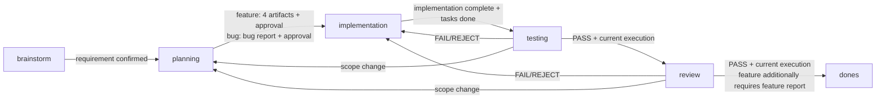

# Gates and the artifact contract

A gate is checked on the way out of the current state. `kf validate` runs the same validator so you see the failures early; `kf stage` and `kf archive` refuse the transition when a gate does not hold.

## Required artifacts

| Phase | File | Minimum contents | Unlocks |
| --- | --- | --- | --- |
| 1 — Brainstorm / bug triage | `phase-1-spec-requirement.md`, a bug using the bug-report template | Feature: the requirement plus FR-XXX. Bug: reproduction, actual against expected, severity, regression strategy | Planning |
| 2 — Planning (feature) | `phase-2-implementation-plan.md` | Scope, tasks, impact, definition of done, risks | The execution contract |
| 2 — Planning (feature) | `phase-2-use-case-specification.md` plus `use-cases/UC-###.md` | Index and coverage in the phase file; each UC carries its own preconditions, flows and alternate or error flows | Design and testing |
| 2 — Planning (feature) | `phase-2-use-case-diagram.md` | A valid actor and use case diagram | Traceability |
| 2 — Planning (feature) | `phase-2-test-case.md` | TC-XXX entries linked to FR-XXX and UC-XXX | The testing contract |
| 4 — Testing | `phase-4-testing-result.md` | The current execution id, a PASS/FAIL/REJECT/BLOCKED verdict, the evidence | Review, or the repair loop |
| 5 — Review | `phase-5-review-report.md` | The current execution id, a PASS/FAIL/REJECT/REQUIREMENT_BUG verdict, the findings | Archive, or the repair loop |
| 6 — Artifact (feature) | `phase-6-feature-report.md` | The summary, what changed, the tests, the docs, the known limits | A finished feature |

Implementation has no required artifact of its own in the schema, but the implement skill must finish the tasks in the plan and leave the code in a state that can be tested.

## Canonical output on entering `dones`

`kf archive` copies from the work item folder to stable paths under the context. Only a feature gets its canonical docs copied automatically:

| Source | Destination |
| --- | --- |
| `phase-1-spec-requirement.md` | `docs/requirement/{context}/{feature}.md` |
| `phase-2-use-case-specification.md` | `docs/use-cases/{context}/{feature}/README.md`, the index |
| `use-cases/UC-###.md` | `docs/use-cases/{context}/{feature}/UC-###.md`, one file per use case |
| `phase-2-use-case-diagram.md` | `docs/use-cases/{context}/{feature}/diagram.md` |
| `phase-2-test-case.md` | `docs/testplan/{context}/{feature}.md` |
| `phase-4-testing-result.md` | `docs/testplan/{context}/{feature}-result.md` |

The canonical requirement is marked `archived`; the other artifacts keep their frontmatter and evidence so they can be traced later. For a bug, archive only moves the work item into `dones`; the related feature's docs change only when the bug report states a docs impact. `--skip-specs` skips this whole table.

## What each direction requires



`implementation → testing` is also blocked while `tasks.md` still holds an unfinished checkbox, which is the definition of done. `tasks.md` is not a required artifact: with no such file, this gate does not apply.

## Contract and traceability

Feature planning builds a chain you can follow:

`FR-XXX` → `UC-XXX` → `TC-XXX` → implementation → testing evidence → review finding.

IDs must match exactly; `FR-001` is never treated as `FR-0010`. A TC missing its FR or UC reference, a reference that does not exist, a duplicate TC id, an empty file or an unreplaced placeholder all fail validation. The agent still has to review the content of each section and the totals in each table.

The validator also scans artifact content for real secrets, such as a Bearer token, an API key, a private key or a password written as `KEY=value`, and fails with `artifact_secret` when it finds one. An artifact must never carry a credential. Placeholder values like `{key}`, `<token>`, `changeme`, `redacted` or a run of four or more `x` are not flagged. The exemption applies to the **captured value**, not to the whole line: `TOKEN=ghp_… # example` is still flagged. High-confidence formats (`ghp_`/`github_pat_`, `sk-`, `AKIA`, `xox*-`, a PRIVATE KEY header) are exempt only when the value itself is masked with `xxxx` or `****`. The error message never echoes the secret.

A testing report with `status: PASS` must also carry a table under the `## Commands and Evidence` heading with at least one command line and every Exit code cell equal to `0`; breaking that is `testing_exit_code`. The rule does not prove the tests ran. It only stops a PASS report that has no numeric evidence behind it. FAIL, REJECT and BLOCKED reports are not bound by it.

The Phase 2 approval is a SHA-256 fingerprint of the requirement, the four planning artifacts and every `use-cases/UC-###.md` for a feature; a bug's fingerprint covers the bug report alone. Editing the contract after approval forces a return to planning, a rewrite and a fresh approval.

## Cancelled

`cancelled` is the one stage with **no artifact gate**. Its `STAGE_INDEX` is `-1`, so every "is this artifact due yet" and "are we past planning" comparison comes out false, and the validator skips artifacts, approval, traceability and report semantics entirely. In exchange it has exactly one requirement of its own: `cancellation.reason` must not be empty, and a missing one is `cancellation_missing`.

`kf cancel` runs the `cancelled.sh` hook like any other transition, refuses while a worker run is live unless `--force`, and for an item in `dones` it **lists** the canonical docs rather than deleting them. Only `--purge-docs` deletes, and it still asks on a TTY. The deletion runs only **after** the work item has moved into `.works/cancelled/` successfully, so a failure during the move cannot lose documents. A cancelled item cannot be archived.

On the numbers: cancelled items are taken out of the denominator of `completionRate`, so dropping something does not dent the rate, and `kf runs` leaves out the runs of a dropped item unless you name it directly with `kf runs <feature>`, exactly as it treats an item in `dones`.

## Force and recovery

`--force` is a deliberate escape hatch for skipping validation or a directional gate. It does not belong in the normal flow, and when it is used the reason must be written into the review or the feature report.

Every time `--force` skips a gate that was actually failing, or `--skip-hooks` skips a hook that actually exists, `kf stage` and `kf archive` write a record into `.kfw.json`:

```json
"bypasses": [
  { "at": "20260919_1230", "from": "brainstorm", "to": "planning", "flag": "force", "codes": ["requirement_unconfirmed"] },
  { "at": "20260919_1231", "from": "planning", "to": "backlog", "flag": "skip-hooks", "codes": ["hook:/path/.kf/hooks/backlog.sh"] }
]
```

A flag that skips nothing, because the gate passed or no hook exists, records nothing. `kf validate` raises the `gate_bypassed` warning, `kf status` prints `Bypasses: N`, and `kf view --json` and the dashboard count the work items carrying one. There is no command to erase a record. The limit is worth stating plainly: this is a trail for a human reviewer, not a guarantee, because an agent can still edit the JSON by hand.

- A phase hook fails: the transition is refused. Fix the hook, or use `--skip-hooks` once you understand what that skips.
- Testing or review comes back `FAIL` or `REJECT`: return to implementation, fix the code, then enter testing again for a new execution id.
- `BLOCKED`: stop and report the blocker. Never fake a PASS.
- `REQUIREMENT_BUG`: stop the feature and tell the user. Continue only on a clear decision from them about the scope or the requirement.
- Archive fails midway: the CLI returns the feature to review and restores the metadata and specs where it can. When the rollback is incomplete, the error says so plainly so it can be sorted out by hand.
