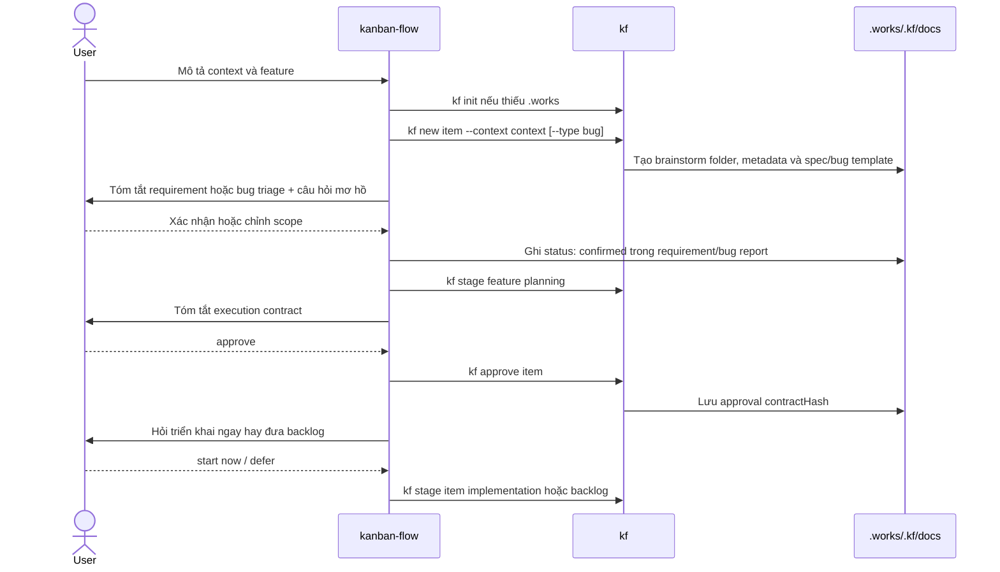
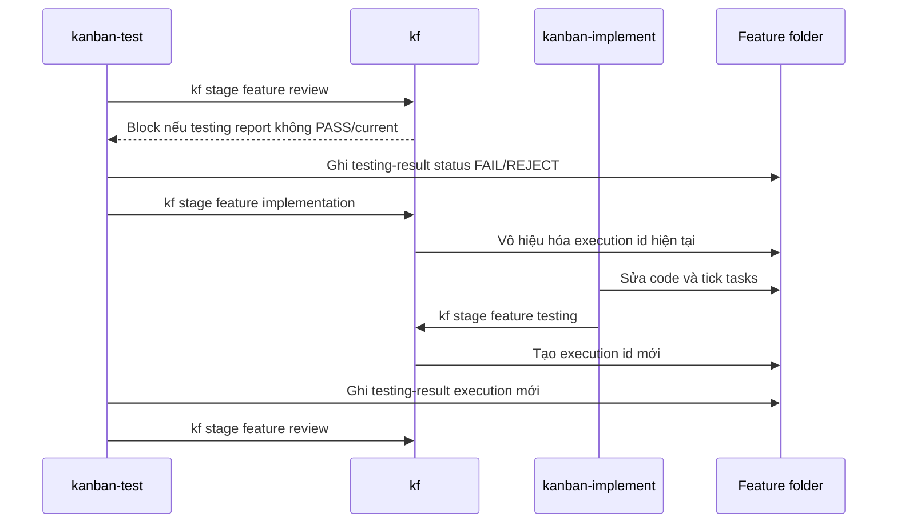

# Workflow Lifecycle

## Luồng tổng thể

```mermaid
flowchart TD
    A([User mô tả feature hoặc bug]) --> B{Project có .works?}
    B -- Không --> C[kf init]
    B -- Có --> D[Đọc repo và chọn phase hiện tại]
    C --> D
    D --> E{Work item là bug?}
    E -- Không --> F[Brainstorm: làm rõ scope và acceptance]
    E -- Có --> G[Bug triage: reproduce + actual/expected + severity]
    F --> H[kf new + phase-1-spec-requirement.md]
    G --> H
    H --> I{Requirement confirmed?}
    I -- Chưa --> E
    I -- Rồi --> J[kf stage item planning]
    J --> K{Work item kind?}
    K -- Feature --> KP[Planning: implementation plan + từng UC file + diagram + test plan]
    K -- Bug --> KB[Planning: triage report + fix scope + regression strategy]
    KP --> L{Human approve execution contract?}
    KB --> L
    L -- Chưa --> K
    L -- Rồi --> M[kf approve: lưu contract fingerprint]
    M --> N{User muốn triển khai ngay?}
    N -- Có --> O[Implementation: tasks.md + code]
    N -- Chưa --> P[Backlog: giữ contract đã duyệt]
    P --> Q{User chọn bắt đầu?}
    Q -- Chưa --> P
    Q -- Có --> O
    O --> R{Build và tasks đạt?}
    R -- Chưa --> O
    R -- Rồi --> S[kf stage item testing]
    S --> T[Tạo execution id mới]
    T --> U[Chạy test theo Test Strategy]
    U --> V[Viết testing-result với execution id]
    V --> W{Testing PASS?}
    W -- FAIL/REJECT --> O
    W -- BLOCKED --> X([Dừng và báo blocker])
    W -- PASS --> Y[kf stage item review]
    Y --> Z[Review changed files với rules project → user → package]
    Z --> AA[Viết review-report với execution id]
    AA --> AB{Review result?}
    AB -- FAIL/REJECT --> O
    AB -- REQUIREMENT_BUG --> AC([Dừng, hỏi user quyết định])
    AB -- PASS --> AD{Work item kind?}
    AD -- Feature --> FC[Viết feature-report]
    FC --> AE[kf archive: copy requirement/use-case/testplan docs]
    AD -- Bug --> BC[Cập nhật docs feature liên quan nếu cần]
    BC --> BA[kf archive: giữ hồ sơ bug + test/review]
    BA --> AF
    AE --> AF([dones: archive hoàn tất])
```

Phase 1, approval Phase 2 và quyết định start/backlog là các điểm cần người dùng quyết định. Feature tạo đủ bốn planning artifact; bug chỉ dùng bug report làm triage contract và không tạo use case/test-plan của feature. Nếu phát sinh hành vi mới ngoài fix scope, báo người dùng quyết định trước khi lập feature riêng. Sau khi chọn start, agent tự chạy trong execution contract. Hai ngoại lệ vẫn cần người dùng: `REQUIREMENT_BUG` và thay đổi scope.

## Sequence khi bắt đầu feature

## Sequence khi sửa lỗi

Report cũ được giữ làm evidence nhưng không được dùng làm kết quả cho execution mới.
