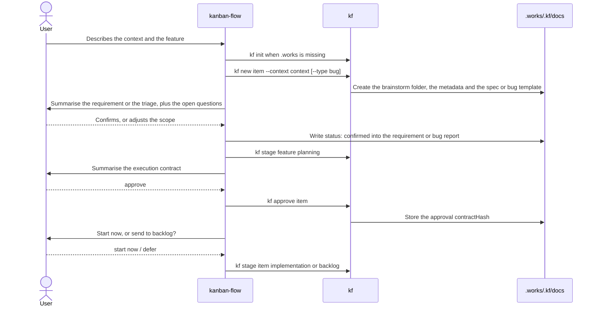
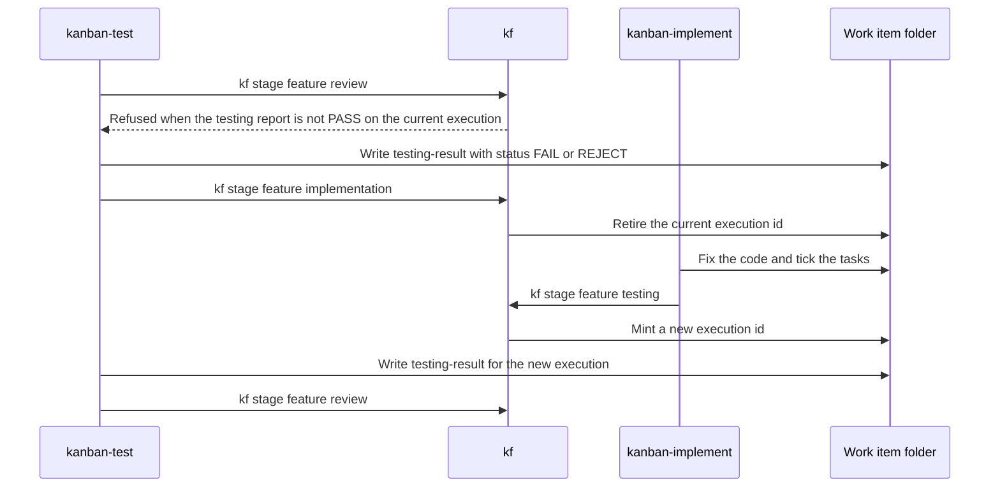

# Workflow Lifecycle

## The whole flow

```mermaid
flowchart TD
    A([User describes a feature or a bug]) --> B{Does the project have .works?}
    B -- No --> C[kf init]
    B -- Yes --> D[Read the repo and pick the current phase]
    C --> D
    D --> E{Is the work item a bug?}
    E -- No --> F[Brainstorm: pin down scope and acceptance]
    E -- Yes --> G[Bug triage: reproduce, actual vs expected, severity]
    F --> H[kf new + phase-1-spec-requirement.md]
    G --> H
    H --> I{Requirement confirmed?}
    I -- Not yet --> E
    I -- Yes --> J[kf stage item planning]
    J --> K{Work item kind?}
    K -- Feature --> KP[Planning: implementation plan + one file per UC + diagram + test plan]
    K -- Bug --> KB[Planning: triage report + fix scope + regression strategy]
    KP --> L{Human approves the execution contract?}
    KB --> L
    L -- Not yet --> K
    L -- Yes --> M[kf approve: store the contract fingerprint]
    M --> N{Start implementation now?}
    N -- Yes --> O[Implementation: tasks.md + code]
    N -- Not yet --> P[Backlog: hold the approved contract]
    P --> Q{User chooses to start?}
    Q -- Not yet --> P
    Q -- Yes --> O
    O --> R{Build green and tasks done?}
    R -- Not yet --> O
    R -- Yes --> S[kf stage item testing]
    S --> T[Mint a new execution id]
    T --> U[Run the tests from the Test Strategy]
    U --> V[Write testing-result carrying the execution id]
    V --> W{Testing PASS?}
    W -- FAIL/REJECT --> O
    W -- BLOCKED --> X([Stop and report the blocker])
    W -- PASS --> Y[kf stage item review]
    Y --> Z[Review changed files against rules: project, then user, then package]
    Z --> AA[Write review-report carrying the execution id]
    AA --> AB{Review result?}
    AB -- FAIL/REJECT --> O
    AB -- REQUIREMENT_BUG --> AC([Stop and ask the user to decide])
    AB -- PASS --> AD{Work item kind?}
    AD -- Feature --> FC[Write feature-report]
    FC --> AE[kf archive: copy requirement, use-case and testplan docs]
    AD -- Bug --> BC[Update the related feature docs if needed]
    BC --> BA[kf archive: keep the bug record with its test and review]
    BA --> AF
    AE --> AF([dones: archive complete])
```

There is a second way out of this flow: `kf cancel <feature> --reason "<why>"` stops a work item for good at any stage, `dones` included when something supersedes it. The reason is mandatory and is stored in `.kfw.json` together with the stage it stopped in, so reopening it is `kf stage <feature> <that stage>`. This is the user's decision; the agent only suggests it on a `REQUIREMENT_BUG` or a dead scope.

Phase 1, the Phase 2 approval and the start-or-backlog decision are the points where the user decides. A feature produces all four planning artifacts; a bug uses its bug report as the triage contract and produces no feature use cases or test plan. If behaviour appears beyond the scope of the fix, tell the user and let them decide before opening a separate feature. Once start is chosen the agent runs on its own inside the execution contract. Two exceptions still need the user: `REQUIREMENT_BUG`, and any change of scope.

## Starting a feature, step by step

## Fixing a failure, step by step

An old report is kept as evidence, but it can never stand in as the result of a new execution.
