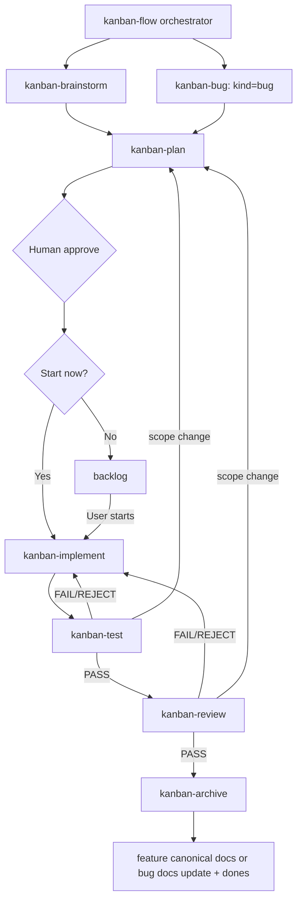

# Skill routing

`kanban-flow` là orchestrator. Mỗi phase skill chỉ chịu trách nhiệm phần việc của phase đó; state thật vẫn do CLI và filesystem quyết định.

## Trách nhiệm

| Skill | Trách nhiệm chính | Không tự quyết |
| --- | --- | --- |
| `kanban-flow` | Đọc state, route phase, nhắc gate, resume đúng điểm dừng | Không tự coi requirement đã confirmed hoặc tự bypass human gate |
| `kanban-brainstorm` | Hỏi/làm rõ problem, goal, scope, acceptance; ghi Phase 1 | Không tự chuyển planning khi chưa được xác nhận |
| `kanban-plan` | Feature: tạo execution plan, từng UC file, diagram, test plan và traceability; bug đơn giản: giữ triage contract, chỉ lập full plan khi behavior contract đổi | Không tự approve contract hoặc tự quyết start/backlog |
| `kanban-bug` | Triage bug, reproduce, actual/expected, severity, root cause và regression requirement | Không tự kết luận root cause hoặc tự start implementation |
| `kanban-implement` | Thực thi task trong contract, giữ scope, cập nhật code/test | Không mở rộng scope hoặc bỏ qua plan mà không quay lại planning |
| `kanban-test` | Chạy test, ghi execution ID và evidence, phân loại PASS/FAIL/REJECT/BLOCKED | Không biến BLOCKED thành PASS |
| `kanban-review` | Review implementation, test, architecture, security và scope | Không archive khi report không PASS |
| `kanban-archive` | Feature: tạo feature report và sync canonical docs; bug: xác nhận docs impact và chỉ cập nhật docs liên quan khi cần, rồi gọi archive CLI | Không xóa dữ liệu hoặc tự deploy/publish |

## Resume và handoff

Khi bắt đầu hoặc tiếp tục một feature:

1. Đọc `kf status --change <feature> --json` và `kf validate --change <feature> --json`.
2. Đọc artifact của state hiện tại và state trước đó; không đoán từ tên thư mục.
3. Nếu đang `planning` và approval stale, hoàn thiện lại contract rồi xin `kf approve` lại.
4. Nếu đang `testing` hoặc `review`, dùng đúng `executionId` trong metadata; report cũ của execution khác không hợp lệ.
5. Nếu có `FAIL`/`REJECT`, sửa ở implementation rồi quay lại testing; nếu `REQUIREMENT_BUG`, dừng để báo người dùng; nếu `BLOCKED`, dừng để báo blocker.
6. Chỉ gọi archive sau khi review PASS; feature cần feature report đầy đủ, bug cần kết luận docs impact.

Artifact phase 6 là tài liệu bàn giao: nó phải nêu thay đổi thực tế, test đã chạy, docs đã cập nhật, giới hạn còn lại và các follow-up được chấp nhận.
