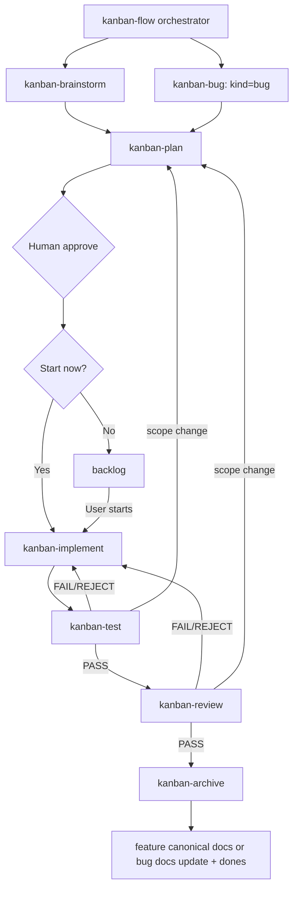

# Skill routing

`kanban-flow` is the orchestrator. Each phase skill owns only that phase's work; the real state stays with the CLI and the filesystem.

## Responsibilities

| Skill | What it owns | What it must not decide alone |
| --- | --- | --- |
| `kanban-flow` | Read the state, route to the phase, name the gate, resume at the right point | Never treat a requirement as confirmed on its own, never bypass a human gate |
| `kanban-brainstorm` | Ask about and pin down the problem, the goal, the scope and the acceptance criteria; write Phase 1 | Never move to planning before the user has confirmed |
| `kanban-plan` | For a feature, produce the execution plan, each UC file, the diagram, the test plan and the traceability; for a simple bug, keep the triage contract and write a full plan only when the behaviour contract changes | Never approve the contract, never choose start or backlog |
| `kanban-bug` | Triage the bug: reproduce it, record actual against expected, severity, root cause and the regression requirement | Never settle on a root cause alone, never start implementation alone |
| `kanban-implement` | Execute the tasks in the contract, hold the scope, update code and tests; subagents run under a prompt contract of task, files, acceptance and constraints, plus the status protocol | Never widen the scope or skip the plan without returning to planning |
| `kanban-test` | Run the tests, record the execution id and the evidence, classify as PASS, FAIL, REJECT or BLOCKED | Never turn a BLOCKED into a PASS |
| `kanban-review` | Review the implementation, the tests, the architecture, the security and the scope, including the AI-risk lens: phantom tests, catch-and-swallow, scope drift | Never archive when the report is not PASS |
| `kanban-archive` | For a feature, write the feature report and sync the canonical docs; for a bug, settle the docs impact and update only the related docs when needed, then call the archive command | Never delete data, never deploy or publish on its own |

## Resuming and handing off

When starting or resuming a feature:

1. Read `kf status --change <feature> --json` and `kf validate --change <feature> --json`.
2. Read the artifacts of the current state and the one before it. Do not guess from the folder name.
3. In `planning` with a stale approval, finish the contract again and ask for a fresh `kf approve`.
4. In `testing` or `review`, use the `executionId` the metadata holds. A report from another execution is not valid.
5. On a `FAIL` or a `REJECT`, fix it in implementation and return to testing. On a `REQUIREMENT_BUG`, stop and tell the user. On a `BLOCKED`, stop and report the blocker.
6. Call archive only after a PASS review. A feature needs its full feature report; a bug needs a settled docs impact.

The phase 6 artifact is the handover document. It states what actually changed, which tests ran, which docs were updated, what limits remain and which follow-ups were accepted.
