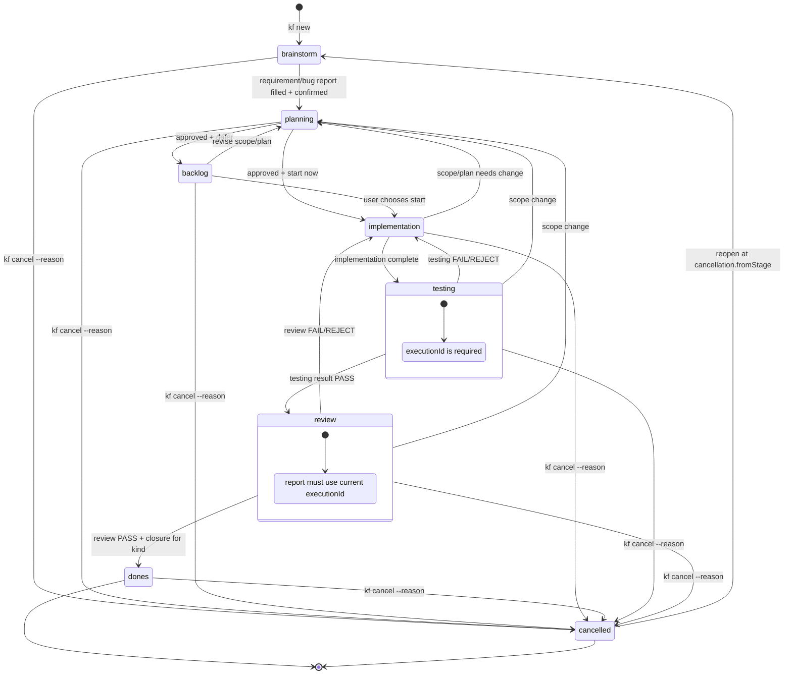

# State machine



## State và transition

| State | Ý nghĩa | Transition hợp lệ |
| --- | --- | --- |
| `brainstorm` | Làm rõ requirement với người dùng | `planning` |
| `planning` | Feature: chốt execution contract; bug: xác nhận triage contract; sau đó approval và quyết định start/backlog | `backlog`, `implementation` |
| `backlog` | Contract đã duyệt nhưng chưa triển khai | `implementation`, `planning` |
| `implementation` | Agent thực thi theo contract đã duyệt | `testing`, `planning` |
| `testing` | Chạy test theo test case và ghi kết quả | `review`, `implementation`, `planning` |
| `review` | Review code, scope, architecture và ghi báo cáo | `dones`, `implementation`, `planning` |
| `dones` | Đã archive, trạng thái terminal | `cancelled` (qua `kf cancel`) |
| `cancelled` | Đã dừng hẳn, không tiếp tục; nằm ngoài trục tuyến tính nên không bị đòi artifact nào | Chỉ quay về đúng `cancellation.fromStage` |

CLI chỉ cho phép các cạnh trên. Không di chuyển thư mục `.works/` thủ công.

## Guard quan trọng

- Requirement/bug report phải được điền và đánh dấu đã xác nhận trước khi rời `brainstorm`.
- Rời `planning` cần đủ 4 artifact planning và các file UC với feature; bug chỉ cần bug report đã filled và approval của người thật. Approval lưu fingerprint của contract tương ứng; sửa nội dung sau approval sẽ làm contract stale.
- Mỗi lần vào `testing` tạo `executionId` mới. `phase-4-testing-result.md` và `phase-5-review-report.md` phải chứa đúng ID hiện tại.
- `FAIL`/`REJECT` quay về `implementation`. `BLOCKED` dừng luồng. `REQUIREMENT_BUG` là stop condition ở review; không được tự rewrite requirement hoặc tự chuyển state.
- Chỉ review `PASS` và testing/review đúng execution mới được vào `dones`; feature cần thêm `phase-6-feature-report.md`, bug không cần file này.
- Vào `cancelled` chỉ qua `kf cancel` và bắt buộc có `--reason`; ra khỏi `cancelled` chỉ về đúng stage đã bị dừng (`cancellation.fromStage`), lúc đó `cancellation` và `status` được xoá khỏi metadata. `kf archive` từ chối item đã cancelled.

Metadata tối thiểu có dạng:

```json
{
  "schema": "kanban-flow",
  "kind": "feature",
  "feature": "payment-retry",
  "context": "billing",
  "approval": {
    "status": "approved",
    "by": "human",
    "at": "20260917_1430",
    "contractHash": "sha256:..."
  },
  "executionId": "uuid-cua-lan-testing-hien-tai"
}
```

`executionId` được reset khi quay lại planning và được cấp lại khi bắt đầu một execution testing mới. Bug report lưu tại `phase-1-spec-requirement.md` bằng template bug; không cần planning artifact của feature. Nếu phát sinh hành vi mới ngoài fix scope, báo người dùng quyết định trước khi lập feature riêng.
