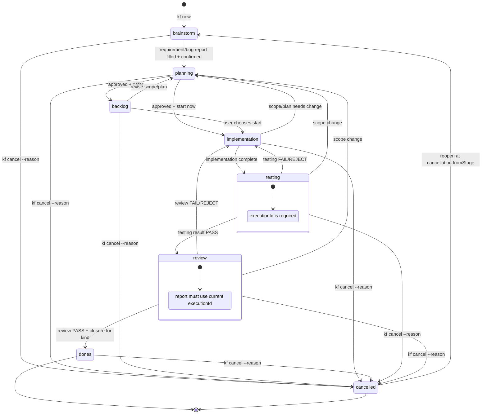

# State machine



## States and transitions

| State | What it means | Allowed transitions |
| --- | --- | --- |
| `brainstorm` | Working the requirement out with the user | `planning` |
| `planning` | A feature settles its execution contract, a bug confirms its triage contract; then approval, then the start or backlog decision | `backlog`, `implementation` |
| `backlog` | The contract is approved but work has not started | `implementation`, `planning` |
| `implementation` | The agent executes against the approved contract | `testing`, `planning` |
| `testing` | Run the tests from the test plan and record the outcome | `review`, `implementation`, `planning` |
| `review` | Review the code, the scope and the architecture, and write the report | `dones`, `implementation`, `planning` |
| `dones` | Archived; a terminal state | `cancelled`, via `kf cancel` |
| `cancelled` | Stopped for good; it sits off the linear track, so no artifact is ever demanded of it | Back to `cancellation.fromStage` only |

The CLI allows only the edges above. Never move a `.works/` folder by hand.

## The guards that matter

- The requirement or bug report must be filled in and marked confirmed before it leaves `brainstorm`.
- Leaving `planning` needs all four planning artifacts and the UC files for a feature; a bug needs only a filled bug report and a real human's approval. The approval stores a fingerprint of the matching contract, so editing the contents afterwards makes it stale.
- Every entry into `testing` mints a new `executionId`. Both `phase-4-testing-result.md` and `phase-5-review-report.md` must carry the current one.
- `FAIL` and `REJECT` return to `implementation`. `BLOCKED` stops the flow. `REQUIREMENT_BUG` is a stop condition in review: never rewrite the requirement or move the state on your own.
- Only a `PASS` review whose testing and review match the current execution reaches `dones`. A feature also needs `phase-6-feature-report.md`; a bug does not.
- The only way into `cancelled` is `kf cancel`, and `--reason` is mandatory. The only way out is back to the stage it stopped in (`cancellation.fromStage`), at which point `cancellation` and `status` are cleared from the metadata. `kf archive` refuses a cancelled item.

The minimum metadata looks like this:

```json
{
  "schema": "kanban-flow",
  "kind": "feature",
  "feature": "payment-retry",
  "context": "billing",
  "approval": {
    "status": "approved",
    "by": "human",
    "at": "20260917_1430",
    "contractHash": "sha256:..."
  },
  "executionId": "uuid-of-the-current-testing-run"
}
```

The `executionId` is reset on a return to planning and reissued when a new testing execution begins. A bug report lives in `phase-1-spec-requirement.md` using the bug template; it needs none of the feature planning artifacts. If new behaviour appears beyond the scope of the fix, tell the user and let them decide before opening a separate feature.
